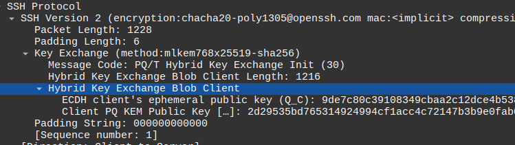

<p align="center">
    <picture>
        
    </picture>
</p>


# ML-KEM key find

This tool search and find for ML-KEM secret polynomials in memory (in live process or in a file dump), and try to reconstruct a secret key or an encapsulated shared secret.

This program makes use of the representation under the NTT (Number Theority Transform) of secret polynomials to detect their presence in memory.

It was presented at the conference [SSTIC 2026](https://www.sstic.org/2026/presentation/mlkemkeyfind__reconstruire_des_cles_depuis_des_residus_memoire/).

## Compilation

Only a C compiler is needed.
Then run the following command:

```sh
make
```

## Usage

Two modes are given:

1. `search`: look for polynomials
2. `analyze`: reconstruct secrets from a public key or ciphertext

### Search mode

The arguments are given below.

```plaintext
Usage: mlkemkeyfind search [ARGS]
Arguments:
  -i <memory dump>    File name of memory dump
  -p <pid>            PID of process
  -o <output>         File name to store secret polynomials found
  -r <search mode>    "centered" or "positive"
  -m                  Search for message polynomials (default to none)
```

Either a memory dump of a process ID must be given.
The output must also be given: the secret polynomials found will be written directly inside.

The `-r` is optional, it indicates how the polynomials are represented in memory mod 3329.
Either they are in their centered representation (default) or in their positive representation.
This depends on the implementation of the library.

The `-m` indicates to also search for message polynomials, used for encapsulating secrets (default to none).

## Analyze mode

```plaintext
Usage: mlkemkeyfind analyze [ARGS]
Arguments:
  -i <input>          File name containing polynomials
  -k <public key>     File name of a public key
  -o <output>         File name to store the reconstructed secret key
  -c <ciphertext>     File name containing a ciphertext (optional)
```

The input file with `-i` is mandatory (output of the previous command).

The public key with `-k` is also mandatory: it is part of the private key and is needed to determine if the polynomials are related to this key.
It is also needed in case the secret polynomials are the ones from an encapsulation, since the public key is used in the derivation of the shared secret.

The output with `-o` will containg the private key if recovered.

The option `-c` is optional.
If provided, the secret polynomials found will be interpreted as the ones used for an encapsulation, and will be used to reverse the encapsulation without the private key.

## Examples

### Golang

The file `test/go/gotest1/gotest1.go` contains a simple example using `crypto/mlkem` that generates a key pair and makes an encapsulation.

To build the program:

```sh
go build -o bin test/gotest1/gotest1.go
```

Then run the program and retrieve the PID:

```sh
./bin/gotest1 & # the PID should appear on the terminal
```

Alternatively, make a memory dump with *gcore*:

```sh
gcore <PID>
```

Use *mlkemkeyfind* to recover the secret key and the shared secret from the encapsulation:

```plaintext
$ ./bin/mlkemkeyfind search -p 31929 -o poly.bin -r positive -m
[*] Searching secret polynomials (NTT) with coefficients in [0, 3328]
[*] Searching message polynomials with coefficients in [0, 3328]
[*] Searching for secrets in memory of process 31929...
[*] Secret polynomials found: 7
[*] Message polynomials found: 1
[*] Search finished.
$
$ ./bin/mlkemkeyfind analyze -i poly.bin -k pub.bin -c ct.bin -o found.prv 
[-] Secret vector 's' found in memory!
[-] Shared secret found from encapsulation vector: 4f9d19704db2e2ee6896ce3afd69f5faedccb32b8b00130a9680e6dcd2cebe0b
[-] Shared secret found: 4f9d19704db2e2ee6896ce3afd69f5faedccb32b8b00130a9680e6dcd2cebe0b
[-] Secret key reconstructed!
```

According to the results:

- the Golang implementation uses coefficient reduced in $[0, 3328]$;
- out of the 7 secret polynomials found, 3 were used to reconstruct the private key;
- the shared secret was recovered with two methods:
  - one of the secret polynomials corresponds to an encapsulation vector that was used to recover the shared secret;
  - the message polynomial was also found in memory and the shared secret recovered directly.

A second example using the experimental module *runtime/secret* to clean the memory is given in `test/gotest2/gotest2.go`.

To build the program:

```sh
GOEXPERIMENT=runtimesecret go build -o bin test/gotest2/gotest2.go
```

Run the program and retrieves the PID and/or a memory dump.
Then use *mlkemkeyfind*:

```plaintext
$ ./bin/mlkemkeyfind search -p 37244 -o poly.bin -r positive -m
[*] Searching secret polynomials (NTT) with coefficients in [0, 3328]
[*] Searching message polynomials with coefficients in [0, 3328]
[*] Searching for secrets in memory of process 37244...
[*] Secret polynomials found: 3
[*] Message polynomials found: 0
[*] Search finished.
$
$ ./bin/mlkemkeyfind analyze -i poly.bin -k pub.bin -c ct.bin -o found.prv 
[-] Secret vector 's' found in memory!
[-] Secret key reconstructed!
```

According to these results, the secret polynomials of the secret vector $\mathbf s$ are still present, but the others are erased from memory.

### Rust

A similar example for Rust is given in the folder `test/rust/`.

Build the test program:

```sh
cargo build --release --manifest-path test/rust/Cargo.toml
```

Run the program and retrieves the PID (or make a memory dump):

```sh
./test/rust/target/release/rusttest
```

Then use *mlkemkeyfind*:

```plaintext
$./bin/mlkemkeyfind search -i core.42376 -o poly.bin -r positive -m
[*] Searching secret polynomials (NTT) with coefficients in [0, 3328]
[*] Searching message polynomials with coefficients in [0, 3328]
[*] Searching for secrets in memory dump...
[*] Secret polynomials found: 6
[*] Message polynomials found: 1
[*] Search finished.
$
$ ./bin/mlkemkeyfind analyze -i poly.bin -k pub.bin -c ct.bin -o /tmp/found.prv 
[-] Shared secret found from encapsulation vector: 682434e35956ff8d470d14e5cfc045022e51ca0c12d36e89d7f2a44e01dede3b
[-] Shared secret found: 682434e35956ff8d470d14e5cfc045022e51ca0c12d36e89d7f2a44e01dede3b
[!] No secret key found
```

According to these results:

- the shared secret is recovered from two methods (same as in the Golang example);
- the other secret polynomials were insufficient to recover the private key.

Indeed, an analysis of the file `poly.bin` shows that only 3 distincts secret polynomials were found: each of them is present twice.
Since one of them is the encapsulation vector, then only two remains.
However, ML-KEM-768 secret vector is composed of three polynomials.

### OpenSSH

Monitor the network with a tool such as Wireshark, then connect to a distant server that supports a scheme such as `mlkem768x25519`.

The client key-exchange contains the ephemeral public key.



> In Wireshark 4.6.3, the order of the algorithms is inverted compared to [PQ/T Hybrid Key Exchange with ML-KEM in SSH](https://www.ietf.org/archive/id/draft-ietf-sshm-mlkem-hybrid-kex-08.html#section-2).
> To retrieve the public key, take the whole blob and remove the last 32 bytes.
> A fix seems to be present in [the master branch since](https://gitlab.com/wireshark/wireshark/-/blob/fcf652a70efda67837d5002c648e6a3f0a81e1a1/epan/dissectors/packet-ssh.c#L2065).

The server key-exchange contains the ciphertext.

> Again, ignore what is presented by Wireshark, take the whole bloc and remove the last 32 bytes.

Now, spy on the process to find secret polynomials:

```plaintext
$ ./bin/mlkemkeyfind search -p 45437 -o poly.bin -m
[*] Searching secret polynomials in NTT form with coefficients in [-1664, 1664]
[*] Searching message polynomials with coefficients in [-1664, 1664]
[*] Searching for secrets in memory of process 45437...
[*] Secret polynomials found: 11
[*] Message polynomials found: 1
[*] Search finished.
$
$ ./bin/mlkemkeyfind analyze -i poly.bin -k pub.bin -c ct.bin -o found.prv
[-] Shared secret found from encapsulation vector: 6ae8f9e31603062e88695344994e2c8e6f3af7671c71401044fdd5f3cbf6dea1
[-] Shared secret found: 6ae8f9e31603062e88695344994e2c8e6f3af7671c71401044fdd5f3cbf6dea1
[!] No secret key found
```

According to these results:

- the implementation uses coefficients centered around 0;
- the shared secret is recovered from two methods (same as in the Golang and Rust examples);
- the secret key was not recovered despite many secret polynomails found.

> The analysis of the file `poly.bin` revealed that many duplicates are present.
> Only three distincts polynomials were found, and one of them is the encapsulation vector.
> The last two were insufficient to reconstruct the secret key which requires three secret polynomials.

## Changelog

- **1.0.0** (2026-05-28): first release

## License

This program is free software and is distributed under the [GPLv3 License](./LICENSE).

```plaintext
This program is free software: you can redistribute it and/or modify
it under the terms of the GNU General Public License as published by
the Free Software Foundation, either version 3 of the License, or
(at your option) any later version.

This program is distributed in the hope that it will be useful,
but WITHOUT ANY WARRANTY; without even the implied warranty of
MERCHANTABILITY or FITNESS FOR A PARTICULAR PURPOSE.  See the
GNU General Public License for more details.

You should have received a copy of the GNU General Public License
along with this program.  If not, see <https://www.gnu.org/licenses/>.
```
